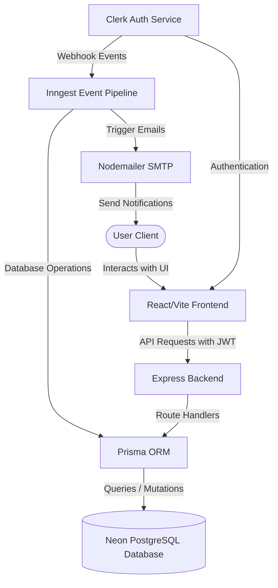

# 🚀 DevSprint — Modern Project Management Platform

DevSprint is a modern, full-stack, collaborative project management platform designed to streamline workspaces, projects, tasks, and team collaboration. Built with a robust **React & Tailwind CSS** frontend and a high-performance **Node.js, Express, and Prisma** backend, it utilizes event-driven background processing to synchronize user data and automate communications.

---

## 📖 Table of Contents

- [✨ Key Features](#-key-features)
- [🛠️ Tech Stack](#️-tech-stack)
- [🏗️ Architecture Overview](#️-architecture-overview)
- [🚀 Local Setup & Getting Started](#-local-setup--getting-started)
  - [Prerequisites](#prerequisites)
  - [1. Backend Setup (`/server`)](#1-backend-setup-server)
  - [2. Inngest Background Jobs Setup](#2-inngest-background-jobs-setup)
  - [3. Frontend Setup (`/client`)](#3-frontend-setup-client)
- [🔑 Environment Variables Config](#-environment-variables-config)
  - [Backend Environment (`/server/.env`)](#backend-environment-serverenv)
  - [Frontend Environment (`/client/.env`)](#frontend-environment-clientenv)
- [📂 Project Structure](#-project-structure)
- [🌐 Backend API Endpoints](#-backend-api-endpoints)
- [🗄️ Database Models (Prisma)](#️-database-models-prisma)
- [🤝 Contributing](#-contributing)
- [📜 License](#-license)

---

## ✨ Key Features

- **📂 Multi-Workspace Environment:** Separate workflows, projects, tasks, and members into independent workspaces.
- **📈 Comprehensive Project Tracking:** Manage projects with custom priorities (`LOW`, `MEDIUM`, `HIGH`), statuses (`ACTIVE`, `PLANNING`, `COMPLETED`, `ON_HOLD`, `CANCELLED`), and automated progress metrics.
- **✅ Dynamic Task Management:** Assign tasks to members, specify due dates, and tag them by type (`TASK`, `BUG`, `FEATURE`, `IMPROVEMENT`).
- **💬 Task Discussion (Comments):** Interact with team members directly inside tasks via real-time commentary.
- **🔐 Secure Clerk Authentication:** Complete user management, session handling, and organization/member tracking using Clerk.
- **⚡ Event-Driven Auth Syncing (Inngest):** Automated database updates triggered by Clerk webhooks (User/Organization creation, modification, and deletion).
- **✉️ Automated Notifications:** Email alerts for new task assignments and automated proximity due-date reminders powered by **Inngest** and **Nodemailer**.

---

## 🛠️ Tech Stack

### Frontend (`/client`)

- **Core Framework:** React 19 (Vite)
- **State Management:** Redux Toolkit (`@reduxjs/toolkit` & `react-redux`)
- **Styling:** Tailwind CSS v4 & Tailwind Vite plugin
- **Icons & UI Elements:** Lucide React
- **Data Visualization:** Recharts (for project progress & team metrics)
- **Navigation:** React Router DOM v7
- **Toasts:** React Hot Toast

### Backend (`/server`)

- **Server Framework:** Node.js & Express
- **ORM / Database Adapter:** Prisma Client & `@prisma/adapter-neon`
- **Database:** PostgreSQL (Hosted on Neon serverless database)
- **Authentication:** Clerk Express SDK (`@clerk/express`)
- **Background Job Engine:** Inngest Express SDK
- **Mailing Service:** Nodemailer (SMTP integration)
- **Websockets:** `ws` package for real-time Postgres connection pooling

---

## 🏗️ Architecture Overview



---

## 🚀 Local Setup & Getting Started

### Prerequisites

Before setting up the project, make sure you have the following installed:

- [Node.js](https://nodejs.org/) (v18.x or higher recommended)
- `npm` or `yarn` / `pnpm`
- A [Neon Console](https://neon.tech/) account for serverless Postgres
- A [Clerk](https://clerk.com/) account for managing authentication
- An [Inngest](https://www.inngest.com/) account or local dev server runner

---

### 1. Backend Setup (`/server`)

1. **Navigate to the server directory:**

   ```bash
   cd server
   ```

2. **Install dependencies:**

   ```bash
   npm install
   ```

3. **Configure the environment file:**
   Create a `.env` file in the `/server` directory and fill in the values described in [Backend Environment Config](#backend-environment-serverenv).

4. **Initialize Prisma Client and Migrate Database:**
   Generate the client and push the schema directly to your Neon database:

   ```bash
   npx prisma generate
   npx prisma db push
   ```

5. **Start the server in Development mode:**
   ```bash
   npm run server
   ```
   The backend server should start on `http://localhost:5000`.

---

### 2. Inngest Background Jobs Setup

Inngest is used to process webhook events and execute background tasks (like sending due-date emails).

1. **Run the Inngest Dev Server locally** to capture and test events:

   ```bash
   npx inngest-cli@latest dev
   ```

   This will run the Inngest dashboard (typically on `http://localhost:8288`), which connects to your backend at `http://localhost:5000/api/inngest`.

2. **Setup Clerk Webhooks (Production/Staging):**
   In the Clerk Dashboard, point your Webhook endpoint to your hosted Inngest URL (e.g., `https://yourdomain.com/api/inngest`) with the following webhook event triggers:
   - `user.created`
   - `user.updated`
   - `user.deleted`
   - `organization.created`
   - `organization.updated`
   - `organization.deleted`
   - `organizationInvitation.accepted`

---

### 3. Frontend Setup (`/client`)

1. **Navigate to the client directory:**

   ```bash
   cd ../client
   ```

2. **Install dependencies:**

   ```bash
   npm install
   ```

3. **Configure the environment file:**
   Create a `.env` file in the `/client` directory and configure the variables detailed in [Frontend Environment Config](#frontend-environment-clientenv).

4. **Start the development server:**
   ```bash
   npm run dev
   ```
   Open `http://localhost:5173` on your browser to view the application.

---

## 🔑 Environment Variables Config

### Backend Environment (`/server/.env`)

Make sure your server environment file contains the following:

```env
NODE_ENV="development"
PORT=5000

# Clerk Keys
CLERK_PUBLISHABLE_KEY=your_clerk_publishable_key
CLERK_SECRET_KEY=your_clerk_secret_key
CLERK_WEBHOOK_SECRET=your_clerk_webhook_secret

# Neon Postgres Database Connection (Pooled & Direct Connection strings)
DATABASE_URL="postgresql://<user>:<password>@<neon_host>/<db_name>?sslmode=require"
DIRECT_URL="postgresql://<user>:<password>@<neon_host>/<db_name>?sslmode=require"

# Inngest Keys
INNGEST_EVENT_KEY=your_inngest_event_key
INNGEST_SIGNING_KEY=your_inngest_signing_key

# Nodemailer / SMTP Configurations
SENDER_EMAIL=your-sender-email@gmail.com
SMTP_USER=your_smtp_username
SMTP_PASS=your_smtp_password
```

### Frontend Environment (`/client/.env`)

Make sure your client environment file contains:

```env
VITE_CLERK_PUBLISHABLE_KEY=your_clerk_publishable_key
VITE_BACKEND_URL=http://localhost:5000
```

---

## 📂 Project Structure

```text
devsprint/
├── client/                 # React Frontend Application
│   ├── src/
│   │   ├── app/            # Redux store config
│   │   ├── assets/         # App assets & styles
│   │   ├── components/     # Reusable UI Components
│   │   ├── features/       # Redux Toolkit Slices (theme, workspace)
│   │   ├── pages/          # Primary views (Dashboard, Projects, Tasks, Team)
│   │   ├── App.jsx         # App Routing & Layout wrapping
│   │   └── main.jsx        # Entry point
│   ├── index.html          # HTML Template
│   ├── vite.config.js      # Vite Configurations
│   └── package.json
│
├── server/                 # Express Backend API
│   ├── configs/            # Configs (Prisma, Nodemailer)
│   ├── controllers/        # Request-Response Handlers
│   ├── inngest/            # Event-Driven background job definitions
│   ├── middleware/         # Auth verification and route protection
│   ├── prisma/             # Schema configuration and migrations
│   ├── routes/             # API Router definitions
│   ├── server.js           # Server runner & router mounting
│   └── package.json
└── README.md               # Project documentation
```

---

## 🌐 Backend API Endpoints

All endpoints (except `/api/inngest`) are protected and require a valid Clerk JWT passed in the request header.

| Endpoint                     | Method         | Description                                                                |
| ---------------------------- | -------------- | -------------------------------------------------------------------------- |
| **Workspaces**               |                |                                                                            |
| `/api/workspaces/`           | `GET`          | Fetches workspaces associated with the authenticated user                  |
| `/api/workspaces/add-member` | `POST`         | Invites/adds a member to a workspace                                       |
| **Projects**                 |                |                                                                            |
| `/api/projects/`             | `GET`          | Get all projects inside a workspace                                        |
| `/api/projects/`             | `POST`         | Create a new project in the workspace                                      |
| `/api/projects/:id`          | `GET`          | Fetch specific project details                                             |
| `/api/projects/:id`          | `PUT`          | Update details of a project                                                |
| **Tasks**                    |                |                                                                            |
| `/api/tasks/`                | `POST`         | Create a task within a project                                             |
| `/api/tasks/:id`             | `GET`          | Fetch task details and its assignee                                        |
| `/api/tasks/:id`             | `PUT`          | Update a task (status, description, priority, assignee)                    |
| **Comments**                 |                |                                                                            |
| `/api/comments/`             | `POST`         | Add a comment to a specific task                                           |
| **Inngest Webhooks**         |                |                                                                            |
| `/api/inngest`               | `POST` / `GET` | Handshake and event receiver for Inngest dev server & Clerk webhook events |

---

## 🗄️ Database Models (Prisma)

DevSprint uses PostgreSQL with the following relations:

- **`User`**: Tracks name, email, avatar image, and associated workspace memberships.
- **`Workspace`**: Represents an organization owning multiple projects and members.
- **`WorkspaceMember`**: Map of users belonging to a workspace, with roles (`ADMIN`, `MEMBER`).
- **`Project`**: Belongs to a workspace and contains multiple tasks. Managed by a Project Owner / Team Lead.
- **`ProjectMember`**: Tracks users added to a specific project.
- **`Task`**: Belonging to a project, assigned to a user, with properties for status, type, priority, and due date.
- **`Comment`**: Discussions associated with a specific task, written by a user.

---
